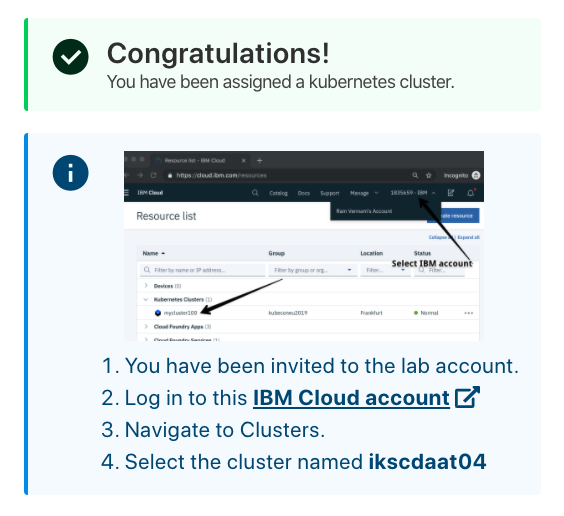
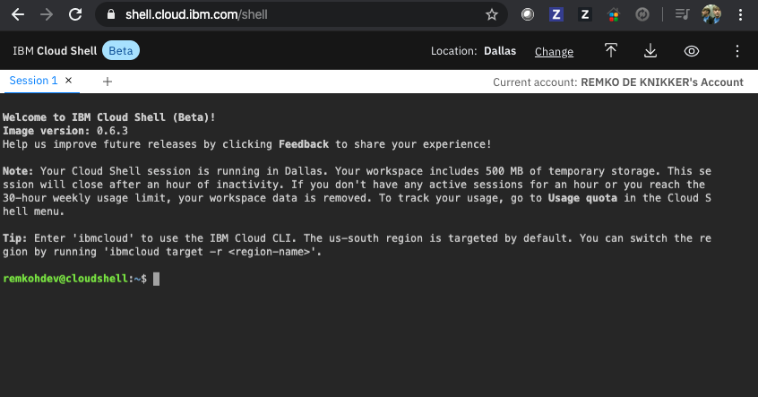

# Pre-work

This section will guide you through the pre-requisites and setup of the environment used in this workshop labs. It is broken up into the following steps:

1. [Sign up for IBM Cloud](#1-sign-up-for-ibm-cloud)
1. [Access a cluster](#2-kubernetes-cluster)
1. [Configure CLI Tools](#3-command-line-tools-/-cloud-shell)

## 1. Sign up for IBM Cloud

You will need an IBM Cloud ID for the workshop. If you already have an IBM Cloud ID, proceed to the next section. If not, follow the steps outlined in [Create Cloud Account](CreateCloudAccount.md) to create your account.

## 2. Kubernetes Cluster

For the hands-on labs, you will be given access to a temporary kubernetes cluster that was pre-created for the purpose of the workshop. The cluster will be deleted after the workshop. To gain access to this cluster:

* Open the URL that was provided to you by the instructor to access your cluster.


* Enter the workshop code provided by the workshop instructor and your IBM Cloud account IBM id. Select the terms and conditions checkbox and click the **`Submit`** button

* You will be added to a cloud account where a cluster has been pre-provisioned for you. Click on the link in the instructions which ask you to `Log in to this IBM Cloud account`.



* If you previously logged in to the IBM Cloud, the browser will direct you to the IBM Cloud resource list view (if you have not logged in previously, you will be asked to log in using your IBM Cloud ID). Expand the `Clusters` section and select the cluster assigned to you (the name will vary).


* Details for your cluster will load. Click on the `Access` menu item in the left navigation column, where you can find instructions to access your cluster from the command line client.


* Note the name of your cluster, you will use this cluster for this lab.

## 3. Command Line Tools / Cloud Shell

Many of the labs will involve interacting with your cluster using command line tools. If you want to install the CLI tools directly on your machine follow the instructions on the `Access` page opened in the last section. If you do not have the command line tools installed on your machine, we recommend you use the [IBM Cloud Shell - https://shell.cloud.ibm.com/](https://shell.cloud.ibm.com/). The IBM Cloud Shell is preconfigured with the full IBM Cloud CLI and tons of plug-ins and tools that you can use to manage apps, resources, and infrastructure.

* From the [IBM Cloud Home Page](https://cloud.ibm.com), select the terminal icon in the upper right hand menu.


* It might take a few moments to create the instance and a new session which automatically logs you in through the IBM Cloud CLI.



   > *Note: Ensure the cloud shell is using the same account where your cluster is provisioned. Check that the account name shown in the top right of the screen, next to `Current account` is the correct one.*

* Run the `ibmcloud ks clusters` command to view your cluster

   ```shell
   ibmcloud ks clusters
   ```

   > *Note: If no clusters are shown, make sure you are targeting the correct IBM account in the top right corner.*

* For convenience, export your cluster name as an environment variable.

   ```shell
   export CLUSTER_NAME=<your_cluster_name>
   ```

* We can now configure the `kubectl` cli available within the terminal for access to your cluster. If you stored your cluster name to an environment variable (ie. `$CLUSTER_NAME`), use that variable, otherwise copy and paste your cluster name from the previous commands output to the `$CLUSTER_NAME` portion below.

   ```shell
   ibmcloud ks cluster config --cluster $CLUSTER_NAME
   ```

* Verify access to the Kubernetes API by getting the namespaces.

   ```shell
   kubectl get namespace
   ```

* You should see output similar to the following, if so, then your're ready to continue.

```text
NAME              STATUS   AGE
default           Active   125m
ibm-cert-store    Active   121m
ibm-system        Active   124m
kube-node-lease   Active   125m
kube-public       Active   125m
kube-system       Active   125m
```

You should now be read to start with labs.

> Note: Every time you log in to the Cloud Shell (or your CLI tools), you must run the above commands to connect with the cluster in IBM Cloud.
